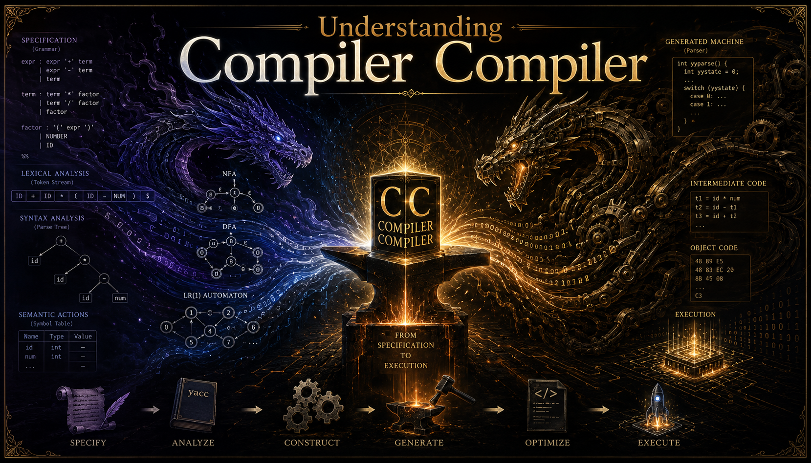

# Understanding CompilerCompiler

> Write down the grammar of a language, and out comes a working compiler for it. Now turn the trick on itself — the system describes its own grammar, then rebuilds itself from that description.

That is what a **compiler-compiler** does. yacc and bison are the famous industrial examples; this site walks through a much smaller, self-defining one **line by line**, so the whole mechanism is visible from the inside.

<!-- SEO intro added by setup-github-pages; review and adjust -->

If you have ever wanted to **build your own compiler from scratch**, see how a **lexer**, a **parser**, and a **code generator** actually fit together, or learn how a tiny system can be powerful enough to **describe itself in its own language**, this **compiler-compiler tutorial** is for you. Topics covered include **recursive descent parsing**, **BNF and formal grammars**, **backtracking**, **production rules**, **output control**, and the **self-definition** that closes the loop — written for programmers who already read C comfortably but have never built a parser by hand.

<!-- /SEO intro -->

By the end you will have walked through every part of a real, working, self-defining compiler-compiler and understood what each piece is doing — including the strangest and most satisfying part: the moment the system reads a description of *itself* and regenerates from that description.

日本語版は [README-jp.md](./README-jp.md) を参照してください。

## Source code

The compiler-compiler being read and explained in this site lives in a separate repository: <https://github.com/t-ishii66/CompilerCompiler>.

## Chapters

1. [A Compiler-Compiler from Scratch](./docs/en/CCDOC.md)
2. [Structure of the Generated File](./docs/en/CCDOC2.md)
3. [Understanding comcom.h](./docs/en/CCDOC3.md)
4. [A Macroscopic Understanding of PEN.c](./docs/en/CCDOC4.md)
5. [Appendix](./docs/en/CCDOC5.md)

## Notes

- This site is published with GitHub Pages.
- Documentation source files are managed in this Git repository.

## Credits

- Author: t-ishii66
- Supervisor: GPT5.3 Codex
- English translation: GPT5.3 Codex, t-ishii66

Copyright(C) 2026 t-ishii66. All rights reserved.
